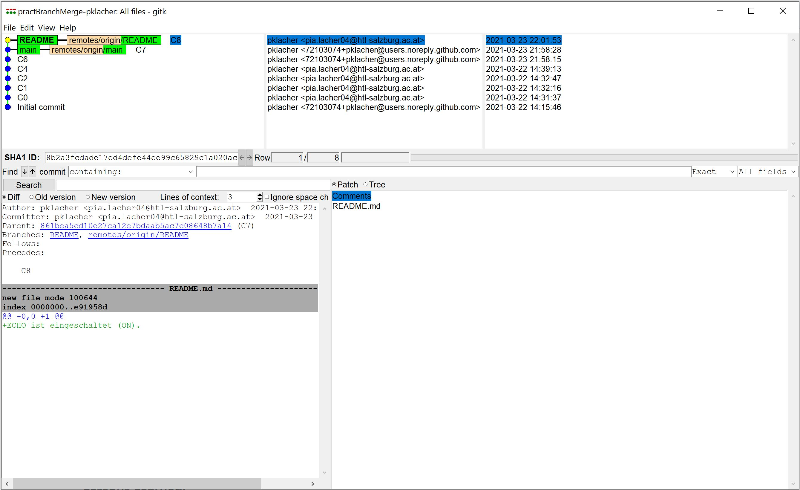

# practBranchMerge-pklacher

### Project description: 
Improve skills with branches and merching.

### Development platform: 
Windows 10, Unity 2020f1.15, Visual Studio 2019

### Target platform: 
WebGL

### Visuals: 

### Necessary setup/execution steps: 

### Third party material: 
Tutorial:
https://git-scm.com/book/de/v2/Git-Branching-Einfaches-Branching-und-Merging

### Project state: 

### Limitations: 

### Lessons Learned: 
<ul>
  <li>creating branches </li>
  <li>merging branches </li>
</ul>
Copyright by Pia Lacher
